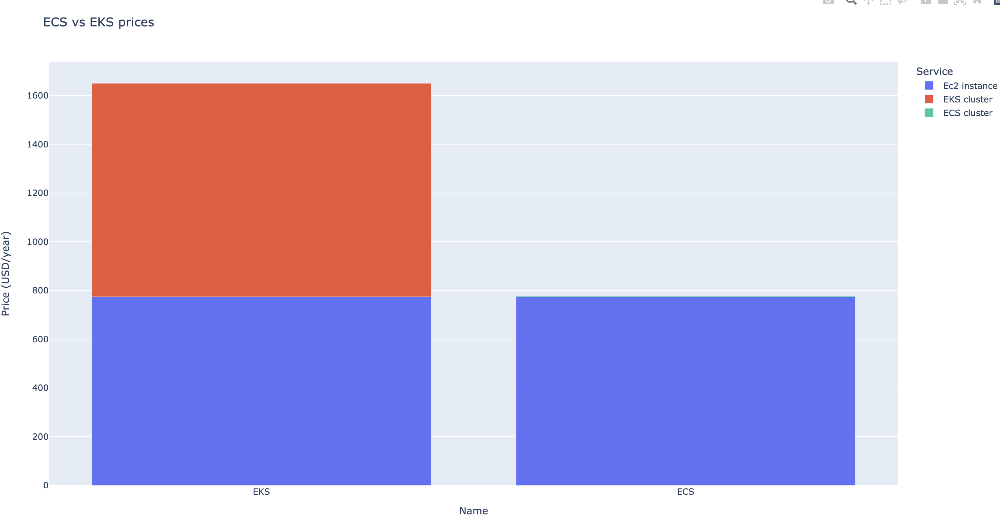

# LOG8415E - Project - ECS-EKS comparison

This work is a class project for the comparison and the implementation of ECS and EKS container services. 

I implemented three things : 

- ECS fargate implementation using aws-ecs cli
- EC2 based ECS implementation using terraform 
- EKS using terraform


## Description 

The code is composed of the following elements : 

- `codes` : the directory with all the codes for each method
- `Dockerfile` : the Dockerfile to run the code (for the class demo)
- `Makefile` : a Makefile to make the demo easier 
- `img` : a directory with image of few results 


## Setup 

First of all, make sure the credentials are set in the `~/.aws/credentials`. 

Then, one should launch the docker container to make the code work on each computer. 

This can be done with the following command : 

```shell
make docker_start
```
It will build the docker image, and run the container (and make the credentials as environment variables). 

### ECS fargate 

- To run the ECS fargate example, that uses command line, use the following command : 

```shell
make launch_ecs_fargate
```

It will start the ECS fargate service, and it will show the current running container. 

Copy paste the IP address such as the port in a browser to see the result : it should show a message `Application 1`. 

- Then, to stop the cluster, use : 

```shell
make stop_ecs_fargate
```

It will delete the ECS cluster such as the running container inside.


## EC2 based ECS cluster using terraform

- To run the EC2 based ECS cluster, one should use the following commands : 

```shell
cd codes/ecs-ec2 && terraform init && terraform apply
```

It will automatically create and launch the ECS instance. It will output the DNS of the load balancer of the ECS cluster. 

This DNS can be copy paste to a a browser to see the running container. 

- To stop the service, use : 

```shell
terraform destroy
```
Don't forget to confirm the command with a `yes` in the terminal (terraform syntax). 


## Results 

To show the plot bar of the comparison of prices between ECS and EKS cluster, use : 

```shell
make cost_plot
```

It will produce a plotly figure : 


| Price comparison |  
|---|  
|  | 


# Author 

- Clément Bernard 

